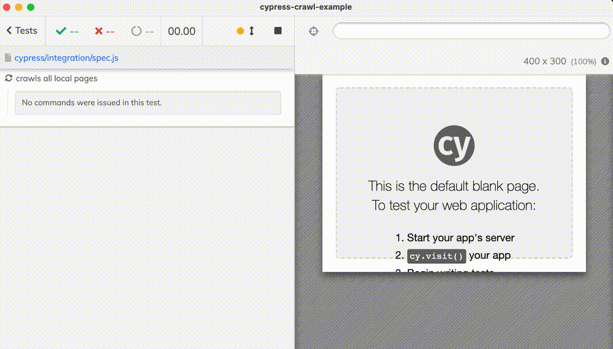
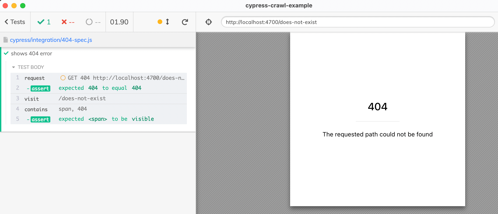

# cypress-crawl-example [![renovate-app badge][renovate-badge]][renovate-app]  [](https://github.com/bahmutov/cypress-crawl-example/actions/workflows/ci.yml)

> Crawling all local pages using Cypress example

Cypress is not built to be a fast crawler, but for simple tests it will do. In this example, we crawl all pages reachable from the root page. See [spec.js](./cypress/integration/spec.js)



In [spec2.js](./cypress/integration/spec2.js) we resolve duplicate URLs by checking them using [cy.request](https://on.cypress.io/request) and taking the redirected URL.

## Testing 404 page

There is automatic 404 page when trying to visit a non-existent page. The test in [404-spec.js](./cypress/integration/404-spec.js) implements the test.



## Blog posts

**Note:** please do not rename the spec files, as the blog post refers to them via GitHub links.

- [Crawl Local Pages Using Cypress](https://glebbahmutov.com/blog/crawl-using-cypress/)

## Videos

- [Crawl Local Pages Using Cypress](https://youtu.be/FDNeiwKWdb4)
- [Test 404 Page](https://youtu.be/0OfILKbqbsg)
- [Crawl Pages With Resource Check](https://www.youtube.com/watch?v=h7taQNvj0Cs)

## To run

```
$ npm install
$ npm run dev
```

## Small print

Author: Gleb Bahmutov &lt;gleb.bahmutov@gmail.com&gt; &copy; 2022

- [@bahmutov](https://twitter.com/bahmutov)
- [glebbahmutov.com](https://glebbahmutov.com)
- [blog](https://glebbahmutov.com/blog)
- [videos](https://www.youtube.com/glebbahmutov)
- [presentations](https://slides.com/bahmutov)
- [cypress.tips](https://cypress.tips)
- [Cypress Advent 2021](https://cypresstips.substack.com/)

License: MIT - do anything with the code, but don't blame me if it does not work.

Support: if you find any problems with this module, email / tweet /
[open issue](https://github.com/bahmutov/cypress-crawl-example/issues) on Github

## MIT License

Copyright (c) 2022 Gleb Bahmutov &lt;gleb.bahmutov@gmail.com&gt;

Permission is hereby granted, free of charge, to any person
obtaining a copy of this software and associated documentation
files (the "Software"), to deal in the Software without
restriction, including without limitation the rights to use,
copy, modify, merge, publish, distribute, sublicense, and/or sell
copies of the Software, and to permit persons to whom the
Software is furnished to do so, subject to the following
conditions:

The above copyright notice and this permission notice shall be
included in all copies or substantial portions of the Software.

THE SOFTWARE IS PROVIDED "AS IS", WITHOUT WARRANTY OF ANY KIND,
EXPRESS OR IMPLIED, INCLUDING BUT NOT LIMITED TO THE WARRANTIES
OF MERCHANTABILITY, FITNESS FOR A PARTICULAR PURPOSE AND
NONINFRINGEMENT. IN NO EVENT SHALL THE AUTHORS OR COPYRIGHT
HOLDERS BE LIABLE FOR ANY CLAIM, DAMAGES OR OTHER LIABILITY,
WHETHER IN AN ACTION OF CONTRACT, TORT OR OTHERWISE, ARISING
FROM, OUT OF OR IN CONNECTION WITH THE SOFTWARE OR THE USE OR
OTHER DEALINGS IN THE SOFTWARE.

[renovate-badge]: https://img.shields.io/badge/renovate-app-blue.svg
[renovate-app]: https://renovateapp.com/
